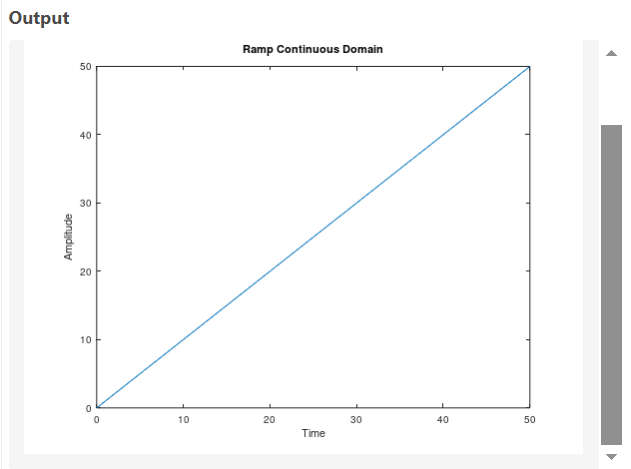
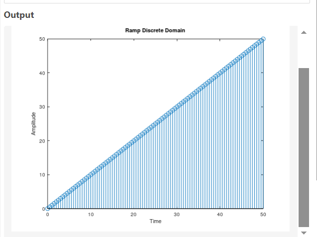

# Generating Ramp Signal

## Continious Code
```bash
m=1;
t=0:0.5:50;
y=m*t;
plot(t,y);
xlabel('Time');
ylabel('Amplitude');
title('Ramp Continuous Domain');

```
## Discrete Code
```bash
m=1;
t=0:0.5:50;
y=m*t;
stem(t,y);
xlabel('Time');
ylabel('Amplitude');
title('Ramp Discrete Domain');
```
## Output

| Continious Domain | Discreet-Domain |
|----------------------|---------------------|
|  |  |