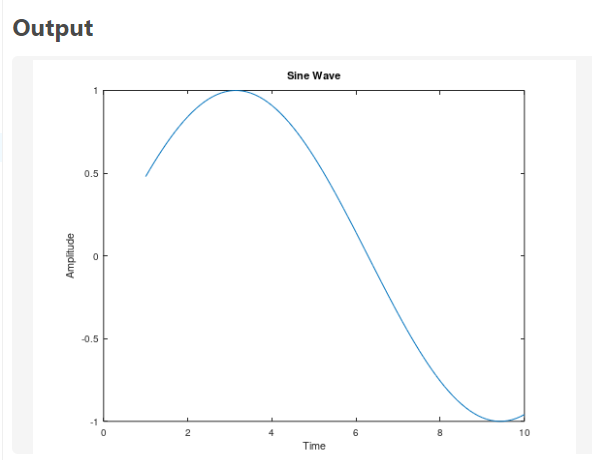
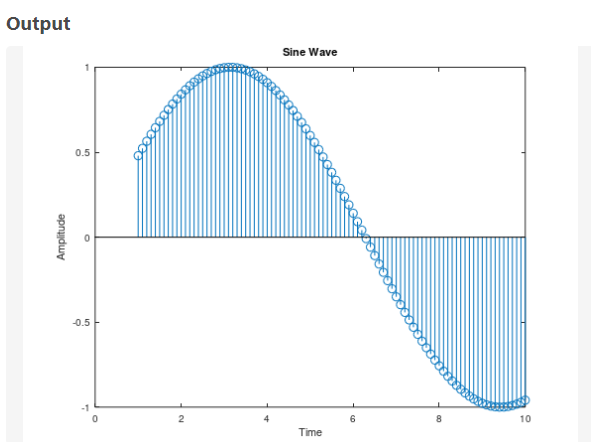

# Generating Sine Wave

## Continious Code
```bash
a=1;
w=0.5;
t=1:0.1:10;
y=a*sin(w*t);
plot(t,y);
title('Sine Wave');
xlabel('Time');
ylabel('Amplitude');
```
## Discrete Code
```bash
a=1;
w=0.5;
t=1:0.1:10;
y=a*sin(w*t);
stem(t,y)
title('Sine Wave');
xlabel('Time');
ylabel('Amplitude');
```

## Output

| Continious Domain | Discreet-Domain |
|----------------------|---------------------|
|  |  |