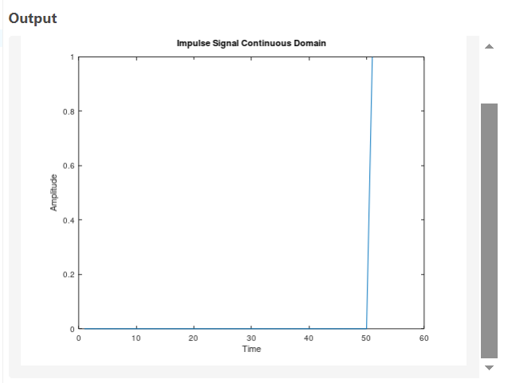
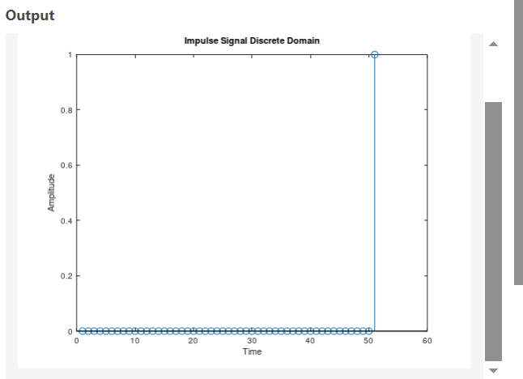

# Generating Impulse Signal


## Continious Code
```bash
y=[zeros(1,50),ones(1,1)];
plot(y);
xlabel('Time');
ylabel('Amplitude');
title('Impulse Signal Continuous Domain');

```
## Discrete Code
```bash
y=[zeros(1,50),ones(1,1)];
stem(y);
xlabel('Time');
ylabel('Amplitude');
title('Impulse Signal Discrete Domain');
```
## Output

| Continious Domain | Discreet-Domain |
|----------------------|---------------------|
|  |  |