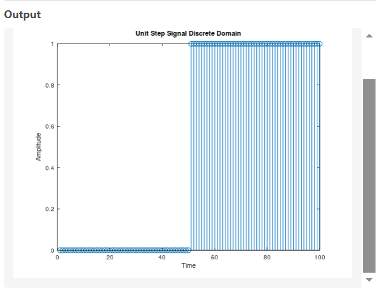

# Generating Unit-Step Wave


## Continious Code 

```bash
y=[zeros(1,50),ones(1,50)];
plot(y);
xlabel('Time');
ylabel('Amplitude');
title('Unit Step Signal Continuous Domain');
```

## Discreet Code

```bash
y=[zeros(1,50),ones(1,50)];
stem(y);
xlabel('Time');
ylabel('Amplitude');
title('Unit Step Signal Discrete Domain');

```
| Continious Domain | Discreet-Domain |
|----------------------|---------------------|
|  |  |