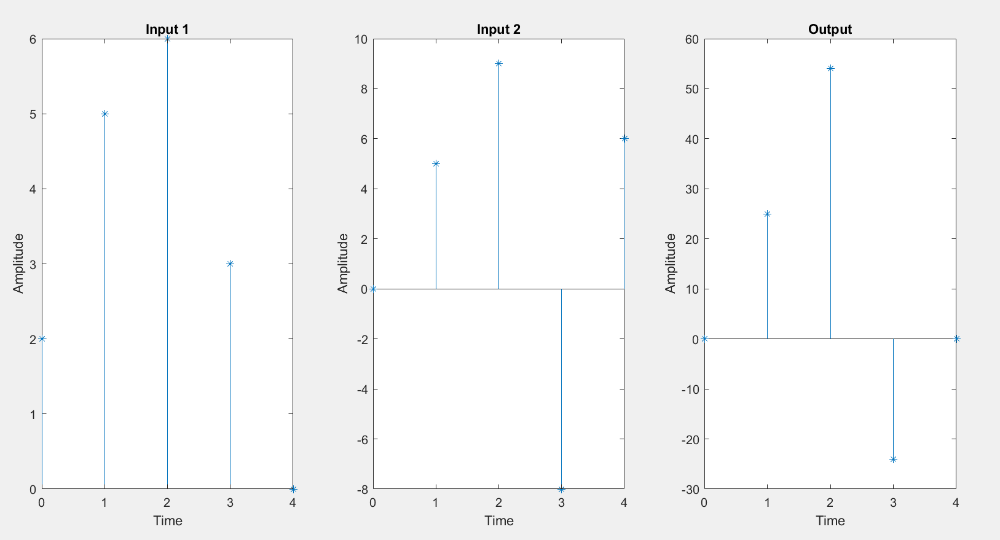

# Multiplictation of 2 Discrete Signal


## Code 

```bash
function multiplication(x1, n1, x2, n2)
  
    m1 = min(min(n1), min(n2));
    m2 = max(max(n1), max(n2));
    
    
    t = m1:m2;
    

    y1 = zeros(1, length(t));
    y2 = zeros(1, length(t));
    
    
    y1(ismember(t, n1)) = x1;
    y2(ismember(t, n2)) = x2;
    
    
    y3 = y1 .* y2;
    
   
    subplot(1, 3, 1);
    stem(t, y1, '*');
    xlabel('Time');
    ylabel('Amplitude');
    title('Input 1');

    subplot(1, 3, 2);
    stem(t, y2, '*');
    xlabel('Time');
    ylabel('Amplitude');
    title('Input 2');

    subplot(1, 3, 3);
    stem(t, y3, '*');
    xlabel('Time');
    ylabel('Amplitude');
    title('Output');
end


```

## Command Window

```bash
x1 = [2 5 6 3];
n1 = [0 1 2 3];
x2 = [5 9 -8 6];
n2 = [1 2 3 4];
multiplication(x1, n1, x2, n2);
```

## Output 
