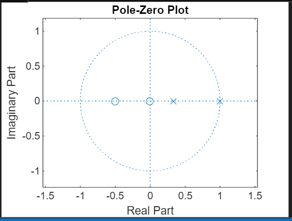

# Z Transform


## Code

```bash
syms z;
f1=2+ (3/z) + (4/ (z^2));
f2=1+ (-1/z) + (2/ (z^2)) -(6/z^3);
f=f1*f2
f3=iztrans (f)
collect (f)
x (z) =2*z+1/ (3*z^2-4*z+1)
num = [2 1];
den = [3 -4 1];
g=tf (num, den)
zplane (num, den)
[p z] =pzmap (num, den)


```

## Output in Command Window after running code (Don,t Copy Paste it in your Command window !!)

```bash
f =
 
-(3/z + 4/z^2 + 2)*(1/z - 2/z^2 + 6/z^3 - 1)
 
 
f3 =
 
kroneckerDelta(n - 1, 0) + 5*kroneckerDelta(n - 2, 0) - 10*kroneckerDelta(n - 3, 0) - 10*kroneckerDelta(n - 4, 0) - 24*kroneckerDelta(n - 5, 0) + 2*kroneckerDelta(n, 0)
 
 
ans =
 
(2*z^5 + z^4 + 5*z^3 - 10*z^2 - 10*z - 24)/z^5
 
 
x(z) =
 
2*z + 1/(3*z^2 - 4*z + 1)
 

g =
 
      2 s + 1
  ---------------
  3 s^2 - 4 s + 1
 
Continuous-time transfer function.Model Properties

p =

    1.0000
    0.3333


z =

   -0.5000

>> 
```

## Output 
