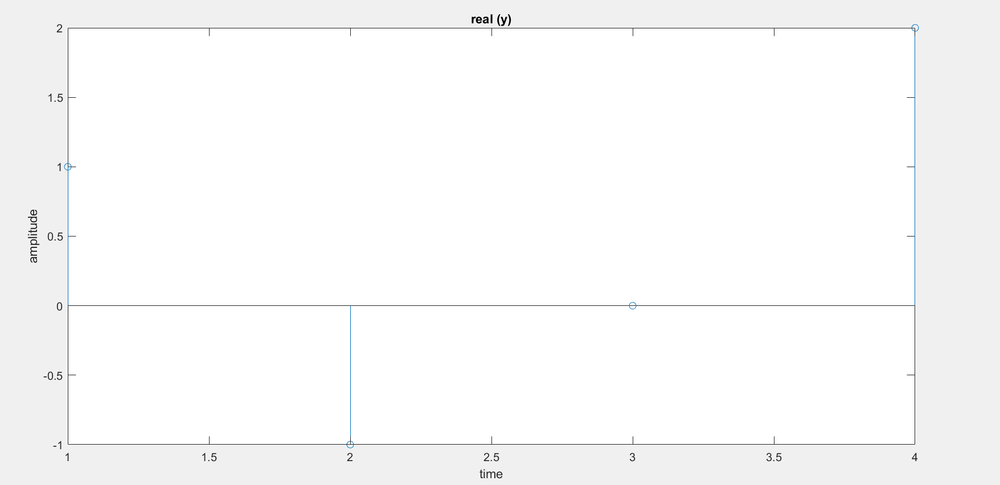

# IDFT


## Code

```bash
function idft(x)
    x=[2 (1+3*j) 0 (1-3*j)];
    n=length(x);
    for p=1:n
     y(p)=0;
     for i=1:n
     y(p)=(y(p)+x(i)*exp(j*2*pi*(i-1)*(p-1)*(1/n))/n);
     end;
    end;
    a=real (y);
    stem (a);
    xlabel('time');
    ylabel('amplitude');
    title('real (y)');
    
```


## Output 


