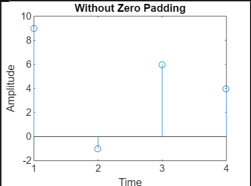

# Without Zero Padding


## Code

```bash
function circ (s1, s2)
    a=length(s1);
    b=length(s2);
    N=a;
    for m=1:N
    y(m)=0;
    for n=1:N
    y(m)=s1(n)*s2(mod((m-n), N)+1)+y(m);
    end;
    end;
    stem(y);
    title('Without Zero Padding');
    xlabel('Time');
    ylabel('Amplitude');
    
```
## Command Window
```bash
s1=[1 3 0 -1];
s2=[-2 4 -1 5];
circ(s1,s2)
```

## Output 



