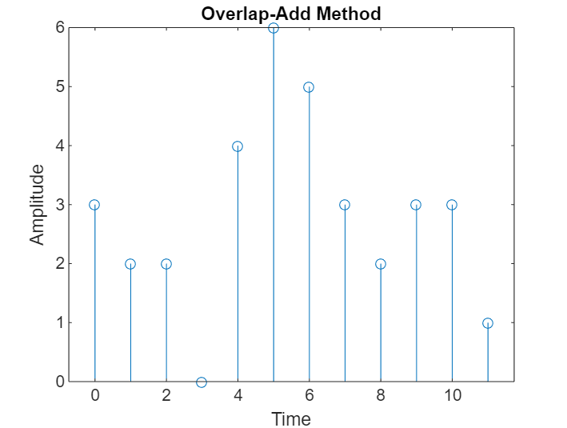

## Overlap Add Method

## Code 
```bash
x = input('Enter the Sequence x(n)= ');
h = input('Enter the Sequence h(n)= ');
n1 = length(x);
n2 = length(h);
N = n1 + n2 - 1;
L = 2^nextpow2(n1 + n2 - 1);
blockSize = L / 2; 
h1 = [h, zeros(1, L - n2)];
H = fft(h1);
y = zeros(1, N);
for i = 1:blockSize:N
 if i + blockSize - 1 <= n1
 x1 = [x(i:i + blockSize - 1), zeros(1, L - blockSize)];
 else
 x1 = [x(i:end), zeros(1, L - (length(x) - i + 1))];
 end
 X1 = fft(x1, L);
 Y1 = ifft(X1 .* H);
 Y1 = round(Y1); 
 y(i:min(i + blockSize - 1, N)) = y(i:min(i + blockSize - 1, N)) + Y1(1:(min(i + blockSize - 1, N - i + 1)));
end
disp('The output sequence y(n) = ');
disp(y);
stem(0:N-1, y);
title('Overlap-Add Method');
xlabel('Time');
ylabel('Amplitude');

```

## Input Command in Command Window
```bash
Enter the Sequence x(n)= 
[3 -1 0 1 3 2 0 1 2 1]
Enter the Sequence h(n)= 
[1 1 1]
```
## Output  in Command Window(Don,t Copy Paste it in the Command Window)

```bash
The output sequence y(n) = 
     3     2     2     0     4     6     5     3     2     3    3    1
```

## Output
