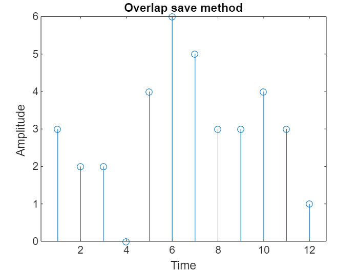

## Overlap Save Method

## Code 
```bash
x= input('Enter the Sequence x(n)= ');
h= input('Enter the Sequence h(n)= ');
n1=length(x);
n2=length(h);

N = n1+n2-1;
h1= [h zeros(1, N-n1)];
n3 = length(h1);
y=zeros(1,N);
x1=[zeros(1,n3-n2) x zeros(1,n3)];
H=fft(h1);
for i=1:n2:N
 y1=x1(i:i +(2*(n3-n2)));
 y2=fft(y1);
 y3=y2.*H;
 y4=round(ifft(y3));
 y(i:(i+n3-n2)) = y4(n2:n3);
end
disp('The output sequence y(n) = ');
disp(y(1:N));
stem(y(1:N));
title('Overlap save method');
xlabel('Time'); 
ylabel('Amplitude ');
```

## Input Command in Command Window
```bash
Enter the Sequence x(n)= 
[3 -1 0 1 3 2 0 1 2 1]
Enter the Sequence h(n)= 
[1 1 1]
```
## Output Command in Command Window(Don,t Copy Paste it in the Coammnd Window)

```bash
The output sequence y(n) = 
  Columns 1 through 9

     3     2     2     0     4     6     5     3     3

  Columns 10 through 12

     4     3     1
```

## Output
