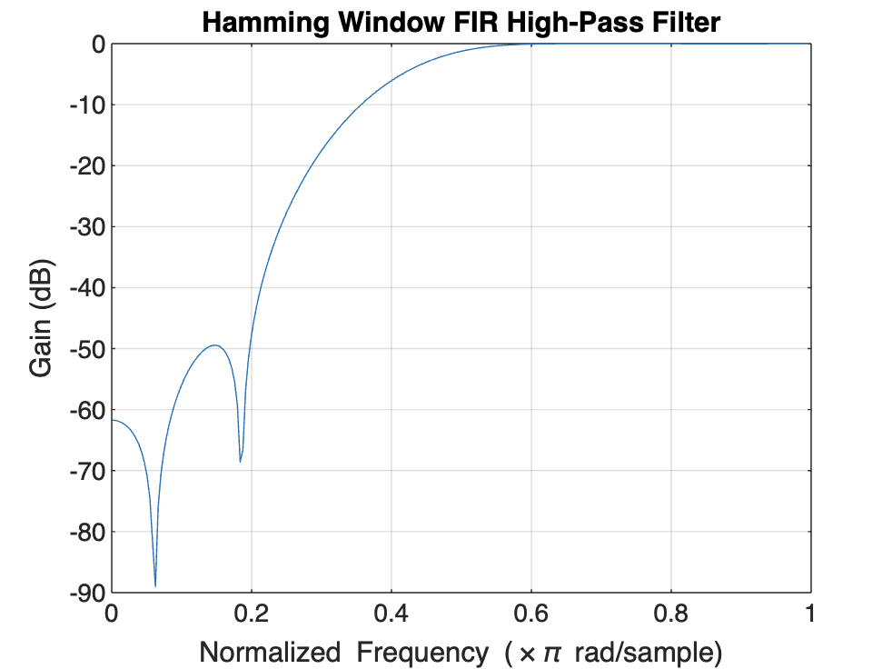

# FIR HPF HAMMING 

## CODE

```bash
function firhigh1(wp, ws, fm)
    % Handle default values if arguments are missing
    if nargin < 3, fm = 1; end   % Default fm = 1
    if nargin < 2, ws = 0.5; end % Default ws = 0.5
    if nargin < 1, wp = 0.3; end % Default wp = 0.3

   
    wc = ((wp + ws) / 2) / fm; 
    ft = abs(wp - ws) / fm;    

   
    if ft <= 0
        error('Invalid transition width: wp and ws must be distinct and positive.');
    end

   
    N = ceil(3.1 / ft);

    
    if N < 1
        error('Filter order N is invalid. Check your wp, ws, and fm values.');
    end

    
    b = fir1(N, wc, 'high', hamming(N + 1));

    
    [H, w] = freqz(b, 1, 256);

    
    plot(w / pi, 20 * log10(abs(H))); 
    title('Hamming Window FIR High-Pass Filter');
    xlabel('Normalized Frequency (\times\pi rad/sample)');
    ylabel('Gain (dB)');
    grid on;
end


```

## OUTPUT

